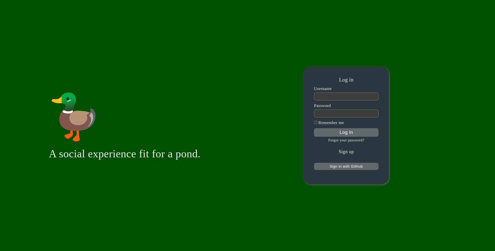
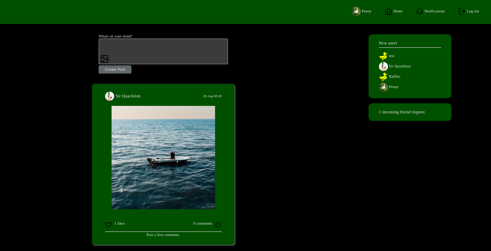
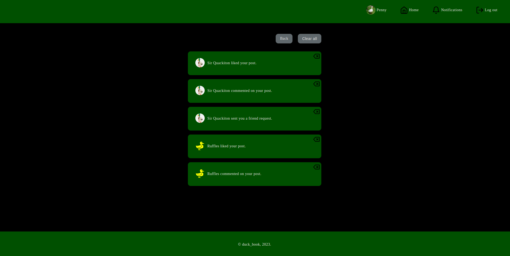

# Duck_book

## Screenshots

  
  
  

## About
Duck_book was created based on The Odin Project's final project for building a [Facebook Clone](https://www.theodinproject.com/lessons/ruby-on-rails-rails-final-project).

## Features

- Log in / Log out

  - utilized [Devise](https://github.com/heartcombo/devise) for user authentication
  - OAuth allows users to login with Github

- Profile

  - User profile showcases tabs for posts created by user, posts liked by user, and posts commented on
  - users can also upload a profile picture in settings to replace the default image
 
## Turbo-features
  Used turbo streams to avoid page reloads and create smooth reponses.

- Posts

  - users can write posts and attach an image
  - posts can have many likes and comments
 
- Likes

  - can have many likes
  - like count updates with turbo

- Comments

  - can have many comments
  - appended comments, and updates the comment count with turbo

- Friendship

  - users can add other users as friends
  - uses turbo streams to avoid page reloads when requests are created, canceled, declined, or accepted

- Notifications

  - notified when comments are made on user's post
  - notified when post recives likes
  - notified when friendships are requested

- Styling

  - styled with vanilla CSS, mostly flexbox and some CSSgrid
  - icons from [featherIcons](https://feathericons.com/)
  
